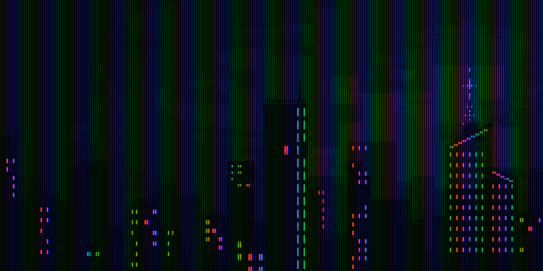

# LCD Pixel Filter

## About this script

An Aseprite script applies LCD-pixel-like filter to pixel-art.

## Example

Original

LCD-pixel-like

## Installation

1. Open your script folder. (File -> Scripts -> Open Scripts Folder)
2. Copy ["lcd pixel filter.lua"](lcd pixel filter.lua)

## In Use

You can edit the source code and distribute it.
You cannot redistribute files with no change without my permission.

## Contact

GitHub Issue or Twitter@Tsukina_7mochi

## LICENSE

[MIT](https://github.com/Tsukina-7mochi/aseprite-scripts/blob/master/LICENSE)