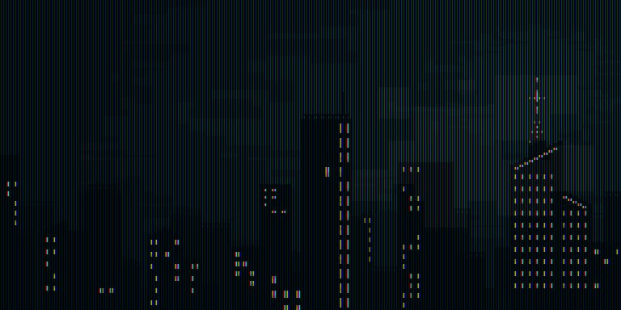

# LCD Pixel Filter

## About this script

An Aseprite script applies LCD-pixel-like filter to pixel-art.

## Example

Original

LCD-pixel-like

## Installation

1. Open your script folder. (File -> Scripts -> Open Scripts Folder)
2. Place "lcd pixel filter.lua"

## Download

[Download](https://github.com/Tsukina-7mochi/aseprite-scripts/releases/latest/download/LCD.Pixel.Filter.lua)

## Others

- This script is provided with [MIT License](https://github.com/Tsukina-7mochi/aseprite-scripts/blob/master/LICENSE)

## Change Log

### 2026.10.03

- Changed versioning scheme to `yyyy.mm.dd`.

### v0.1.1

- Introduce NebLua bundler.

### v0.1.0

- First release.
